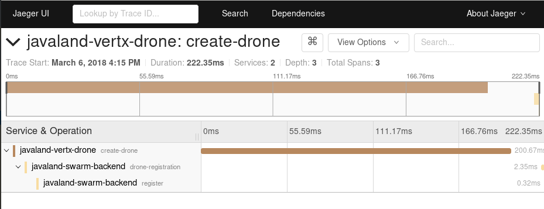
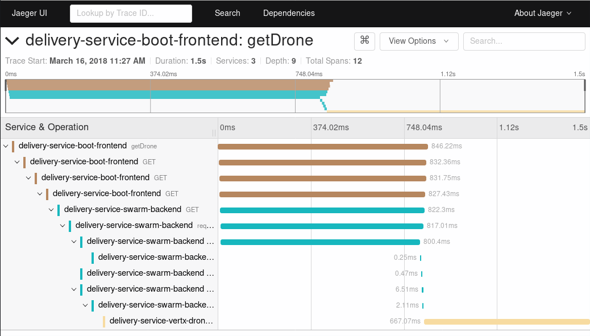
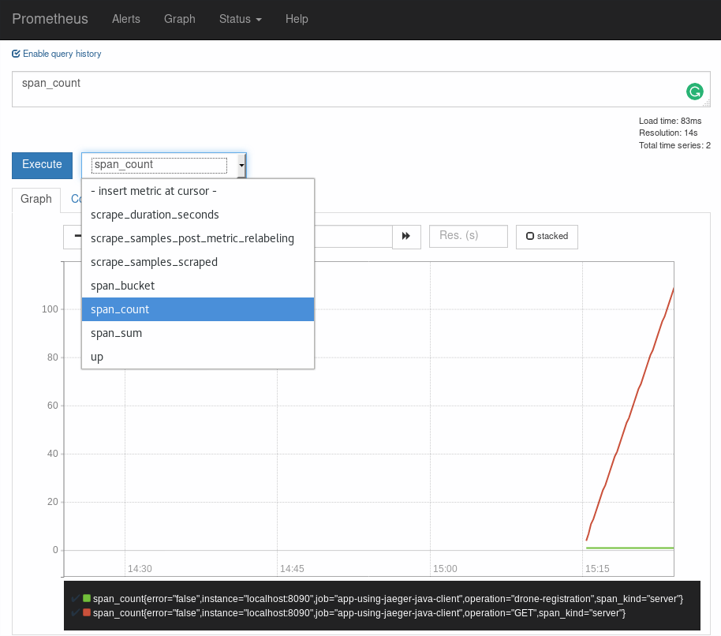

= Drone Delivery Service

This is one of three repositories that are part of the demo for the talk about using distributed
tracing to find performance bottlenecks. The others are
https://github.com/jpkrohling/delivery-service-boot-frontend[`delivery-service-boot-frontend`]
and https://github.com/jpkrohling/delivery-service-vertx-drone[`delivery-service-vertx-drone`].

== What is this demo about?

The demo shows three microservices:

* Frontend, implemented using Spring Boot. On a real application, this would be a
mobile client or a web client
* Backend, implemented using Wildfly Swarm
* Drone, implemented using Eclipse Vert.x . This represents an IoT device. In our case,
it's a drone.

Whenever a new drone is created, it connects to the backend and performs a registration.
It keeps a web socket opened and is ready to be dispatched to a client.

A drone can be requested by making an HTTP call to the frontend. It would then connect
to the backend, which will select a drone and dispatch it, by sending a message on the drone's
socket.

Therefore, there are two trace "templates" that are of interest: one for the registration,
involving two services (Drone + Backend) and one for the Drone request (Frontend + Backend + Drone).

The Frontend (Spring Boot) application exposes a `Tracer` bean, showing how to use a custom Jaeger Tracer
object. We could, however, use the Tracer Resolver facility and configure the Jaeger client via env vars.
Other than this `Tracer` bean and the appropriate runtime dependencies, there's no knowledge about
OpenTracing or Jaeger: everything is done via automatic configuration and auto-instrumentation.

The Backend (Wildfly Swarm) has a bit more knowledge about Jaeger and OpenTracing, specially because
it exposes a Metrics Servlet that can be used by Prometheus. The web socket has manual instrumentation
and explicit `inject`/`extract` operations, showing what happens "behind the scenes" on auto instrumentation
code. One "business" code has knowledge about OpenTracing: `LocatorService`. It shows how to augment the "current"
span with business data via custom tags. The other business objects have no explicit OpenTracing code and are automatic
instrumented via the `OpenTracingInterceptor` from the `opentracing-ejb` library.

The Drone (Eclipse Vert.x) has a lot of knowledge about OpenTracing and, like the web socket, shows
how to propagate the context to/from a remote service via `inject`/`extract` operations. When created, a drone
keeps a web socket opened with the backend, closing it when the server disappears.

== Running the demo

. Start the Jaeger backend:

    docker run -p5775:5775/udp -p6831:6831/udp -p6832:6832/udp -p16686:16686 -p14268:14268 jaegertracing/all-in-one:latest

. Create a `/tmp/prometheus.yaml` with the following content:

    global:
      scrape_interval: 15s
    scrape_configs:
      - job_name: 'delivery-service-swarm-backend'
        scrape_interval: 5s
        static_configs:
          - targets: ['localhost:8090']

. Start Prometheus, using the `/tmp/prometheus.yaml` configuration file:

    prometheus --config.file=/tmp/prometheus.yaml

. Make sure you can access both http://localhost:9090[Prometheus] and http://localhost:16686[Jaeger] UIs.

. Start the backend. From the same directory as of this README, execute:

    mvn wildfly-swarm:run -Dswarm.port.offset=10

. Wait until the message `WFSWARM99999: WildFly Swarm is Ready` is shown

. Create one or more drones. From the `delivery-service-vertx-drone` root directory, execute:

    ./gradlew run

. If everything works, a message like the following should be shown:

    2018-03-16 11:20:00 INFO  MainVerticle:61 - Hello, I'm the drone f71f6746-d955-48dd-8405-ae85dcc28c00

. On the backend, you should see some log statements about the new Drone being registered. You should
also be able to find traces on Jaeger's UI. Just refresh the UI and select the service `delivery-service-vertx-drone`
and click "Find traces". A trace named `delivery-service-vertx-drone: create-drone` should be available.

. Start the frontend. From the `delivery-service-boot-frontend` root directory, execute:

    export JAEGER_SERVICE_NAME=delivery-service-boot-frontend
    export JAEGER_REPORTER_LOG_SPANS=true
    export JAEGER_SAMPLER_TYPE=const
    export JAEGER_SAMPLER_PARAM=1
    ./gradlew bootRun

. If everything works, a message like the following should be shown:

    2018-03-16 11:18:37.969  INFO 12357 --- [           main] d.frontend.FrontendApplication           : Started FrontendApplication in 6.785 seconds (JVM running for 7.102)

. You can now request drones:

    curl http://localhost:8080/

. You should see new log entries on all services. After refreshing Jaeger's UI, you should also be able to find a trace
named `delivery-service-boot-frontend: getDrone`. This trace should show spans across all three services.

. Upon refreshing the Prometheus UI, metrics such as `span_count` should be available. Those are reported
automatically by the backend (Wildfly Swarm) service, but not from the other services.

== References

* https://programm.javaland.eu/2018/#/scheduledEvent/549371[JavaLand - Finding Performance Bottlenecks with Distributed Tracing]
* http://prometheus.io[Prometheus]
* http://jaegertracing.io[Jaeger]
* http://opentracing.io[OpenTracing]